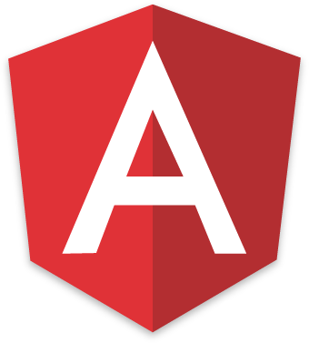
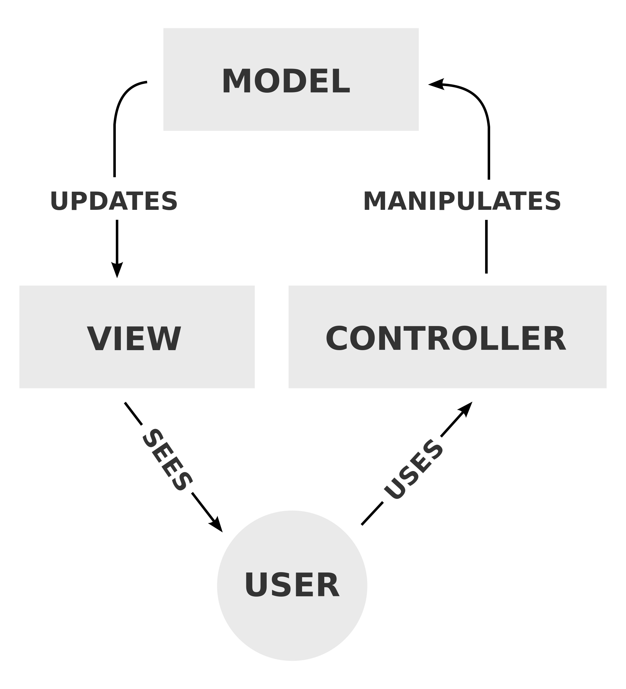
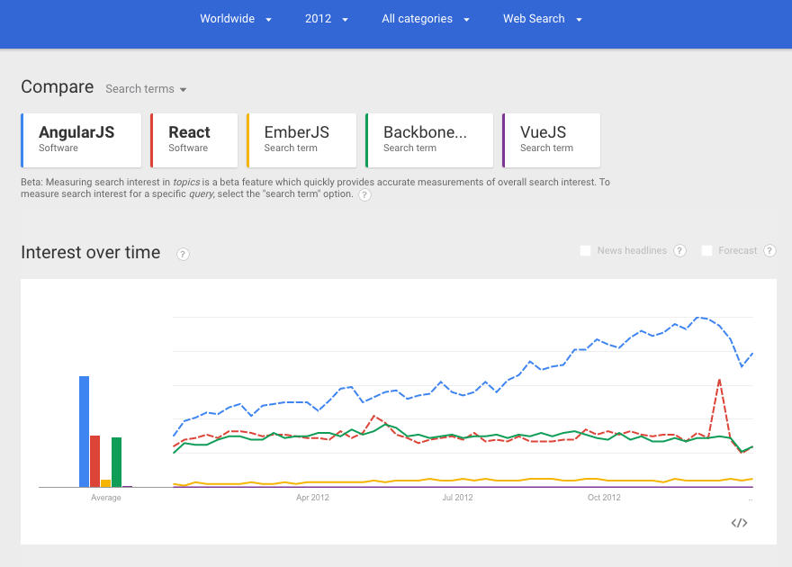

# Angular

O Angular é um framework JavaScript, mantido pelo Google, no estilo MVC/MVVW e usa o conceito de SPA (Single Page Application). No SPA, apenas uma parte da *view* muda e a outra permanece fixa. Isso traz melhoras na experiência do usuário e diminuição no tráfego de dados por não precisar renderizar tudo toda vez.

Ele foi desenvolvido por Miško Hevery e Adam Abrons, em 2009, como um [SaaS](https://pt.wikipedia.org/wiki/Software_como_servi%C3%A7o) de armazenamento de JSON online, que teria seu preço estimado por megabyte, para aplicações pré-construídas (easy-to-make) para as empresas.

*fonte: *

E já estamos indo para sua [segunda versão](https://angular.io/)  onde ele foi completamente re-escrito, utilizando das melhores novidades do [ES6](http://es6-features.org/), porém isso é assunto para um módulo futuro, aguarde...

Como vimos anteriormente o Angular é um framework, mas o que isso significa?

> Um framework (ou arcabouço), em desenvolvimento de software, é uma abstração que une códigos comuns entre vários projetos de software provendo uma funcionalidade genérica. Um framework pode atingir uma funcionalidade específica, por configuração, durante a programação de uma aplicação. Ao contrário das bibliotecas, é o framework quem dita o fluxo de controle da aplicação, chamado de Inversão de Controle.

*fonte: [https://pt.wikipedia.org/wiki/Framework](https://pt.wikipedia.org/wiki/Framework)*

Isso significa que ele nos dá uma estrutura pronta onde precisamos apenas criar códigos, de preferência modular, da forma que o framework nos pede.

Essa é a maior diferença entre uma biblioteca e um framework.

## MVC? MVVM? MVP? MVW? WTF?!

Essa sopinha de letras têm um significado, vamos começar pelo **MVC**.

Esse é nosso tão conhecidp MVC porém utilizado, conceitualmente, erroneamente, por quê?

Vamos a sua definição da [Wikipedia](https://pt.wikipedia.org/wiki/MVC)

> Model-view-controller (MVC), em português modelo-visão-controlador, é um padrão de arquitetura de software (design pattern) que separa a representação da informação da interação do usuário com ele. O modelo (model) consiste nos dados da aplicação, regras de negócios, lógica e funções. Uma visão (view) pode ser qualquer saída de representação dos dados, como uma tabela ou um diagrama. É possível ter várias visões do mesmo dado, como um gráfico de barras para gerenciamento e uma visão tabular para contadores. O controlador (controller) faz a mediação da entrada, convertendo-a em comandos para o modelo ou visão. 

Bom você deve ter percebido que a *View* é uma **representação dos dados** nesse caso, conceitualmente, ela é um espelho do *Model* pois é nele que se encontram os dados.

> Logo, não seria lógico que **QUALQUER** alteração no *Model* fosse automaticamente mostrada na *View*?

Pois é!

Pelo menos isso o Angular faz, automaticamente, por utilizar o *two-way data binding* que veremos mais adiante.

**- Beleza Suissa mas e o resto das siglas?**

Ahhhhh! Agora sim chegamos em um ponto altamente conceitual.

**-Por quê?**

Porque simplesmente não faz a menor diferença para nós, pois **MVVW** que significa *Model, View, View-Model* é a mesma coisa que o **MVP** que significa *Model, View, Presenter*. Sendo assim o Angular adotou a nomenclatura **MVW** que significa *Model, View, Whatever* pois todas conceituam a mesma coisa.

Temos o *Model* com nossos dados e a *View* que os mostra, agora a integração deles pode ser tanto chamado como *View-Model* ou *Presenter* pois basicamente trabalham com as informações entre a *View* e o *Model* e isso para nós não fará nenhuma diferença, mas é interessante que você saiba essas nomenclaturas para não ficar perdido no meio de tantos conceitos novos que vemos aparecer no *Frontend*.

Nisso chegamos em um questionamento muito pertinente sobre o Angular:

## Suporte

> Qual o suporte do Angular para navegadores?

Falemos apenas dessa última versão, 1.5.x, ela possui suporte para a maioria dos navegadores porém para [Internet Explorer apenas para maior que a versão 9](https://docs.angularjs.org/guide/ie), acredito que na versão 1.2 ele ainda dê suporte ao IE8, mas quem quer saber dessa merda?

**Agora eu que lhe digo: PARE DE DAR SUPORTE PARA IE MENOR QUE O 9!!!**

Com o Angular iremos desenvolver **SISTEMAS** e não **SITES**, logo se você desenvolve um sistema você tem certo pré-requisitos para executar ele, assim como tem **MUITOS** programas que só rodam no Windows, no caso do Angular ele só roda **EM TODOS OS NAVEGADORES** menos IE com versão menor que a 9.

Simples não?

Pense que o IE já está na versão 11 e se não formos nós a forçar os usuários a se atualizarem eles ainda continuariam no Windpows XP com IE 7!

Porém acredito que para se tomar a decisão de qual *framework* utilizar o desenvolvedor precisa conhecer alguns dados sobre ele e acredito que atualmente um dos maiores divisores de água é o *tamanho da sua comunidade* e também a *requisição do mesmo no mercado de trabalho*.

Beleza então abordemos esse assunto.

O Angular é um dos *framework*, se não o, mais utilizado no mercado e há um bom tempo vem despontando como podemos ver nessa comparação de interesses via [Google Trends](https://www.google.com/trends/?hl=pt-BR)

Fora isso grandes empresas usam e o próprio Google diz ter mais de 100 projetos utilizando-o, então acredito que ele dá(rá) um ótimo suporte e fomenta(rá) cada vez mais a comunidade.

Além do que a comunidade, tanto no [Github]() como no [StackOverflow](), é altamente ativa, dificilmente vc precisará de algo que alguém ainda não fez e mesmo se precisar é JS, né? ;p
