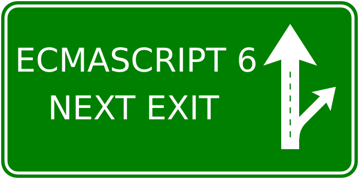

#ES6

## Ementa

- Let (feito no módulo Node.js)
- Const (feito no módulo Node.js)
- Arrow Functions (feito no módulo Node.js)
- Tail Call Optimization
- Template String
- Default Params
- Rest Params
- Spread Operator
- Destructuring
- Generators
- Iterables & iterators
- Maps & Sets
- Promises
- Modules
- Classes

## Aulas

- Aula 1
    + Review let, const, arrow
    + Tail Call Optimization
    + Template String
    + Default Params
- Aula 2
    + Rest Params
    + Spread Operator
    + Destructuring
- Aula 3
    + Generators
        * koa
    + Iterables & iterators
- Aula 4
    + Maps & Sets
    + Promises
- Aula 5
    + Modules
    + Classes

Referências bibliográficas:

- [http://exploringjs.com/es6/](http://exploringjs.com/es6/)