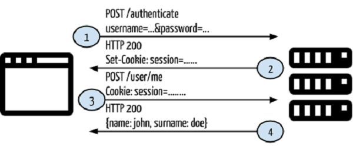
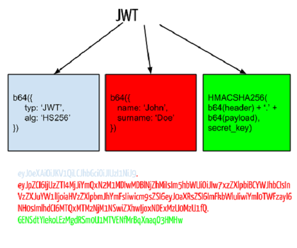

# JWT - JSON Web Token

Antes de começar a falar de *tokens* precisamos entender melhor os sistemas de autenticação tradicionais primeiro, **basicamente** é isso:

1. Quando o usuário for fazer login irá preencher seu email e senha.
2. Chagando no backend seus dados são validados consultando sua existência no banco de dados.
3. Caso encontre esse usuário o sistema cria uma sessão e retorna o ID dessa sessão no cabeçalho de resposta para ser usado no Frontend.




O JWT é uma tecnologia frequentemente usada para **transmissão de dados** e **autenticação**.

A definição do mesmo trás duas palavras chaves que estão destacadas, vamos dá uma lida juntos:

O JWT é um padrão aberto [RFC](https://tools.ietf.org/html/rfc7519) que define uma forma segura, *autocontida* e *compacta* de envio de dados entre partes, esta informação pode ser verificada e confiável pois é assinada digitalmente. O JWT pode ser assinado usando um algoritmo (HMAC) ou uma chave pública/privada usando **RSA**.


Vamos para as definições:

***compacta***: Por ser extremamente leve o JWT é perfeito para API então, obviamente a sua transmissão na rede é bem rápida, o que também significa dizer que para dispositivos que demandam uma banda limitada de rede, o consumo de dados para autenticar um cliente é sumariamente reduzido em relação ao outra abordagem.

***autocontida***: A definicão trás um termo chamado ***payload*** que contém os dados do usuário, por exemplo:

```json
{
  "name":"Jean Mestre da Treta Nascimento",
  "nick":"suissa",
  "admin":true
}
```

Outro termo usado no *payload* são as ***claims*** (ou reenvidicações) que são usadas para autorizar o envio de mensagem atráves do *token*, as *claims* são os dados do usuário, por isso o termo usado no payload é autocontido, porque contém por si só os dados que precisam ser usados.

A estrutura do JWT é semelhante a essa:

```
xxxxx.yyyyy.zzzzz
```

Essa estrutura é basicamente separada por pontos `.`  e cada ponto indica uma coisa, mostrada abaixo:

```
cabeçalho-->xxxxx;
payload-->yyyyy;
signature-->zzzzz;
```

E assinatura? O que ela significa?

A assinatura é um agoritmo baseado no *secret* que é definido no *Backend* da sua aplicação e criptografado randomicamente em base-64, você pode usar outra forma de criptografar essa assinatura, como HMAC-SHA256, inclusive. A grande importância da assinatura é que ela permite que o *token* seja imodificável durante sua transmissão pela rede.


```js
HMACSHA256(
  base64UrlEncode(header) + "." +
  base64UrlEncode(payload),
  secret)
```

*Esse trecho mostra como fazer uma assinatura baseado na secret e no sha-256*


