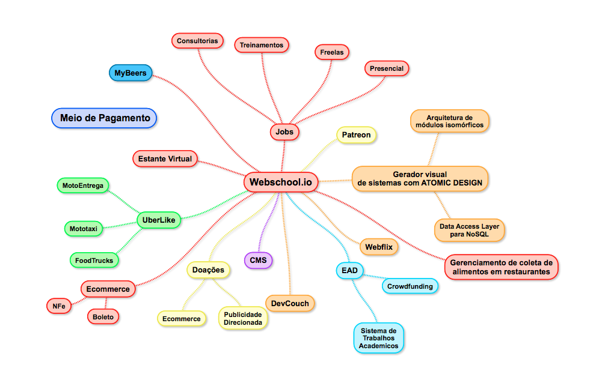

# Projetos

Esses são alguns projetos interessantes de serem feitos, mesmo já existindo **ISSO NÃO IMPORTA** pois estaremos fazendo para aprender e como resultado estaremos contribuindo com a comunidade e com nós mesmos, pois serão projetos que nós iremos utilizar, por isso faremos da nossa forma e do "jeito certo". LOL

Obviamente os projetos não serão finalizados completamente em 1 mês, mas iremos sempre definir qual seu MVP para que caiba em 1 mês e já definir as próximas etapas para poder planejar corretamente.

Projetos:

- Pattern Lab com gerador de código
- EAD
- CMS - Tem q ser melhor que o Wordpress
- Gerenciador de Projetos para PO/Gerentes em cima do Github
- Nota Fiscal Eletronica
- Boletos
- Ecommerce
- [Estante Virtual - Livros](./Estante-Virtual)
- Meio de Pagamento
- Gerenciamento de cervejas tomadas
- Gerenciador de eventos
    - não que gerencie as entrada mas sim:
      + fornecedores
      + local
      + patrocinadores
      + palestra
      + palestrantes
      + coffe break
- Sistema de Vagas/Jobs por requisitos
- Sistema de couchsurfing para devs
- Sistema de trabalhos acadêmicos anti-plágio
- Sistema de Uber-like - motoboy/mototaxi
- Sistema para Food Trucks
    + venda via pagamento digital, etc
    + acompanhamento em tempo real online
    + cardapio online
    + Qm sabe pedidos online
- Sistema para reaproveitamento de alimentso dos restaurantes
    + Tipo um sistema de gerenciamento de coleta

Sistemas que já existem mas podemos fazer melhor:

- WhatsApp
  + funcione web e desktop sem depender do celular
  + gravar seu histórico, criptografado, localmente
  + funcione offline e via p2p
- Uber
  + motoboys
    * para entregas
  + mototaxi
    * para corridas

## Projetos exclusivo para alunos

- EAD
- Ecommerce
- Meio de Pagamento
- Sistema de Vagas/Jobs por requisitos

## Mapa Mental



## Metodologia

Como estamos utilizando a metodologia do Atomic Design a primeira coisa que precisamos fazer é definir seus Átomos.

Obviamente fica bem difícil sabermos quais os campos necessários sem conhecer as entidades, Moléculas.

Vamos pegar de exemplo o projeto de Doações, podemos dizer que usas entidades/moléculas são:

- Usuário
- Doador
- Projeto
- Doação
- Fornecedor

Após a definição dessas entidades já podemos começar a definir os Átomos, porém ainda não estamos atrelando os Átomos às Moléculas.

Vou listar apenas alguns para dar ideia:

- nome
- email
- password
- telefones: ddd, numero
- endereço: 
  - logradouro
  - nome
  - numero
  - complemento
  - cep
  - estado
  - pais
- cpf
- cnpj
- razao_social

Após definirmos quais os átomos precisamos agora definir os quarks de cada átomo.

Vamos pegar como exemplo o Átomo `nome`:

```js
const Atom = {
  type: String
, get: require('./../quarks/toUpper')
, set: require('./../quarks/toLower')
, validate: require('./../quarks/notEmptyStringMongoose')
, required: true
, index: true
}

module.exports = Atom;
```

Sabemos que a estrutura acima é a estrutura padrão para qualquer Átomo do Mongoose, onde cada atributo do Átomo é um Quark.

Vamos ver como será alguns de seus Quarks:

```js
// toUpper.js
module.exports = (v) => v.toUpperCase();

```

```js
// toLower.js
module.exports = (v) => v.toLowerCase();
```

```js
// notEmptyStringMongoose
'use strict';

const notEmpty = require('./notEmptyString');

module.exports = {
  validator: (value) => {
    return notEmpty.validate(value);
  }
, message: 'O valor {VALUE} para o campo nome não pode ser vazio!'
};
```

Para facilitar o reuso eu separei os Quarks puros dos especificos para o Mongoose, pois o Quark do Mongose tem uma estrutura diferente do Quarks básico, os nossos Quarks não possuem o campo de mensagem, por exemplo.

Então no caso eu uso o Quark base `notEmptyStringMongoose` que utiliza o Quark `notEmptyBASE`:

```js
// notEmptyString
'use strict';

const notEmpty = require('./notEmptyBASE');

module.exports = {
  validate: (value) => {
    const validated = notEmpty.validate(value);
    if (!validated) return false;

    const isOnlyLetters = require('./isOnlyLetters')(value);
    if (!isOnlyLetters) return false;

    return true;
  }
};
```

```js
// notEmpty
'use strict';

module.exports = {
  validate: (value) => {
    if (value === null || value === undefined) return false;
    return true;
  }
};
```

Dessa forma podemos criar Quarks mais complexos apenas agregando Quarks menores.

Com isso nós montamos 1 Átomo, agora basta fazer a mesma coisa para todos os Átomos, não esquecendo de **SEMPRE** criar os Quarks antes de tudo.


