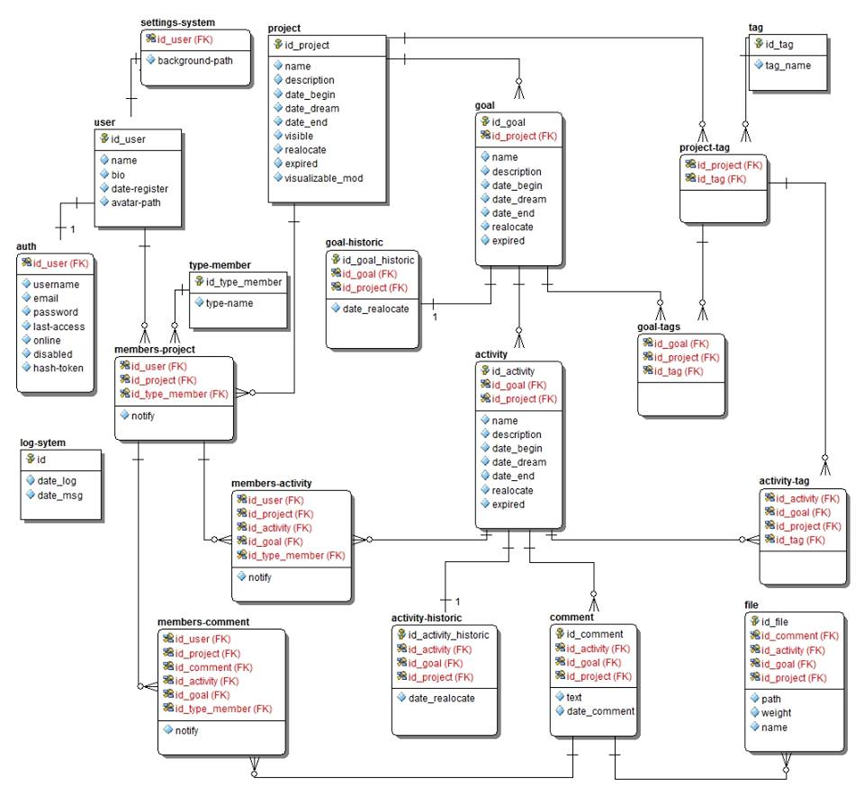
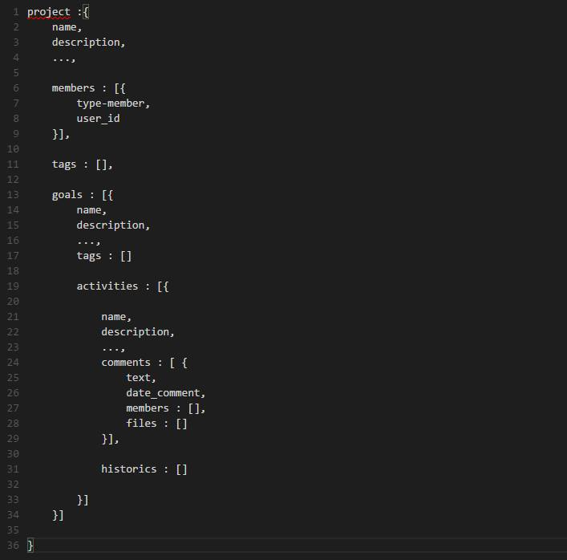

# Projeto Final

No projeto final desse módulo você terá que achar qual a melhor forma de modelagem a partir de uma já previamente feita.

A ideia surgiu de um post do [Jorge Rafael](https://www.facebook.com/kurybr?fref=nf) no grupo do Facebook com a seguinte modelagem relacional.



Logo após o [Herbert Pimentel](https://www.facebook.com/herbertpferreira?fref=ufi) postou a seguinte modelagem que irá servir de base para nosso projeto final.



Perceba que falta a coleção de `user` que será **seu trabalho criar uma** a partir dos dados da modelagem relacional.

Além de criar a coleção `user` e achar uma modelagem melhor da proposta, **terá que explicar o porquê daquela escolha** e terá que executar as seguintes ações em suas coleções:

## Create - cadastro

1. Cadastre 10 usuários diferentes.
2. Cadastre 5 projetos diferentes.
    - cada um com 5 membros, sempre diferentes dentro dos projetos;
    - cada um com pelo menos 3 tags diferentes;
        - escolha 1 *tag* onde deva ficar em 2 projetos;
        - escolha 1 *tag* onde deva ficar em 3 projetos;
    - cada projeto com pelo menos 1 *goal*;
        - cada *goal* com pelo menos 3 *tags*;
        - cada *goal* com pelo menos 2 atividades, deixe 1 projeto sem.

## Retrieve - busca

1. Liste as informações dos membros de 1 projeto específico que deve ser buscado pelo seu nome de forma a não ligar para maiúsculas e minúsculas.
2. Liste todos os projetos com a tag que você escolheu para os 3 projetos em comum.
3. Liste apenas os nomes de todas as atividades para todos os projetos.
4. Liste todos os projetos que não possuam uma tag.
5. Liste todos os usuários que não fazem parte do primeiro projeto cadastrado.


## Update - alteração

1. Adicione para todos os projetos o campo `views: 0`.
2. Adicione 1 tag diferente para cada projeto.
3. Adicione 2 membros diferentes para cada projeto.
4. Adicione 1 comentário em cada atividade, deixe apenas 1 projeto sem.
5. Adicione 1 projeto inteiro com **UPSERT**.

## Delete - remoção

1. Apague todos os projetos que não possuam *tags*.
2. Apague todos os projetos que não possuam comentários nas atividades.
3. Apague todos os projetos que não possuam atividades.
4. Escolha 2 usuário e apague todos os projetos em que os 2 fazem parte.
5. Apague todos os projetos que possuam uma determinada *tag* em *goal*.

## Gerenciamento de usuários

1. Crie um usuário com permissões **APENAS** de Leitura.
2. Crie um usuário com permissões de Escrita e Leitura.

## Cluster

Depois de criada toda sua base você deverá criar um cluster utilizando:

- 1 Router
- 1 Config Server
- 3 Shardings
- 3 Replicas

Você deverá escolher qual sua coleção deverá ser *shardeada* para poder aguentar muita carga repentinamente e deverá replicar cada Shard, pode ser feito localmente como em alguma VPS FREE.


## Estrutura

```
# MongoDb - Projeto Final
**Autor:** Nome Completo
**Data** Data da entrega

## Para qual sistema você usaria o MogoDB (diferente desse)?

## Qual a modelagem da sua coleção de `users`?

## Qual a modelagem da sua coleção de `projects`?

## Create - cadastro

## Retrieve - busca

## Update - alteração

## Delete - remoção

## Sharding
// coloque aqui todos os comandos que você executou

## Replica
// coloque aqui todos os comandos que você executou

```
