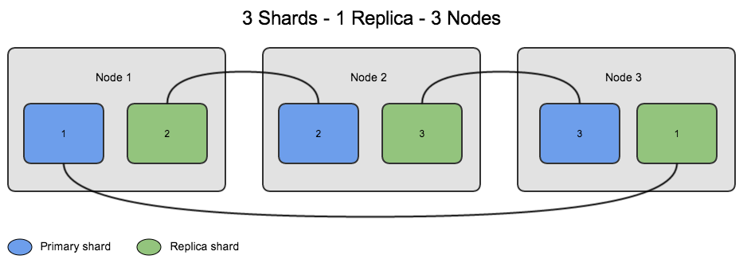

# Replica

Possuímos *Replicas* na maioria dos bancos de dados relacionais também, ela faz o espelhamento dos seus dados de um servidor para outro.

No MongoDb funciona da mesma forma, porém podemos replicar também os shardings.

A replicação ocorre em 2 etapas:

- Initial Sync;
- Replication.

## Initial Sync

O Initial Syn ocorre no início, quando uma *Replica* copia todos os dados de outra. Uma *Replica* utiliza-se do Initial Sync quando ela é nova ou não tem nenhum dado ou possui dados mas está faltando o histórico de replicação.

Quando você executa um Initial Sync o MongoDb irá:

- Clonar todos os bancos de dados. Para clonar, o mongod consulta cada coleção em cada banco de dados de origem e insere todos os dados em suas próprias cópias dessas coleções. Neste momento, os índices _id também são construídos. O processo de clonagem apenas copia os dados válidos, omitindo documentos inválidos.
- Aplicar todas as alterações para o conjunto de dados. Usando o *oplog* a partir da fonte, o mongod atualiza seus dados para refletir o estado atual do conjunto de *Replicas*.
- Construir todos os índices em todas as coleções (exceto índices _id, que já foram concluídos).
- Quando o mongod acabar de construir todos os índices, o membro pode fazer a transição para um estado normal, ou seja secundário.

## Replication

Membros do conjunto de *Replicas* replicam os dados continuamente após a sincronização inicial. Este processo mantém os membros atualizados com todas as alterações para os dados do conjunto de *Replicas*. Na maioria dos casos, secundários sincronizam a partir do primário. Secundários podem mudar automaticamente os seus alvos de sincronização, se necessário com base em mudanças no tempo de ping e estado de replicação de outros membros.

## oplog

O **oplog** (log de operações) é uma *[capped collection](https://docs.mongodb.org/manual/reference/glossary/#term-capped-collection)* especial que mantém os registros de todas as operações de modificação de dados.

MongoDB aplica as operações no primário e, em seguida, registra as operações no oplog do primário. Os membros secundários, em seguida, copiam e aplicam essas operações em um processo assíncrono.

Todos os membros do conjunto de *Replicas* contém uma cópia do oplog, na coleção [local.oplog.rs](https://docs.mongodb.org/manual/reference/local-database/#local.oplog.rs), o que lhes permite manter o estado atual da base de dados.

Para facilitar a replicação, todos os membros do conjunto de *Replicas* enviam batimentos cardíacos (pings) para todos os outros membros. Qualquer membro pode importar entradas oplog de qualquer outro membro.

## Por que usar?

Porque sempre devemos ter uma garantia dos nossos dados e uma *Replica* serve exatamente para isso, garantir que seus dados existam em outro lugar também, caso o seu servidor principal caia você poderá levantar outro com os dados da sua *Replica*.

## Quando usar?

## Como usar?
